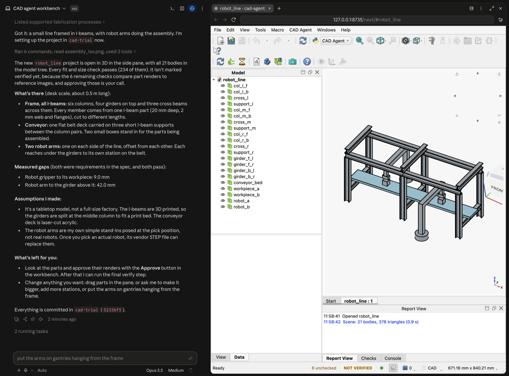

# cad-agent

AI agents that design mechanical parts. You describe a part or an assembly; the agent writes it as code, checks that the parts fit, and shows you the result in a live 3D workbench where you can move parts yourself. A design is only marked done when every check passes.

## Demo

Ask Claude Code for a design; it builds it, checks it, and opens it in the workbench next to the chat. Here: a small robot assembly line in I-beams, with 21 parts and 234 fit and size checks passing.



More designs: the workbench inspector, and an Arduino car.


| | |
|---|---|
|  |  |

## Install

In Claude Code:

```
/plugin marketplace add El-Guapo2024/cad-agent
/plugin install cad-agent@cad-agent
```

Then ask it to design something ("design a bracket for a NEMA 17 motor"), and open the workbench with `/cad-agent:workbench`.

## How to use

1. **Open a session in your project folder.** Make it a git repo: only committed work counts as verified. The first session after installing sets up the CAD kernel, which takes a few minutes.
2. **Ask for a design** in plain words, like "a small assembly line framed in I-beams, with two robot arms". Claude writes each part as code in `cad-projects/<name>/`, checks that everything fits, and commits it.
3. **Look at it** with `/cad-agent:workbench`. The 3D workbench opens next to the chat, with every part in the model tree.
4. **Change it** by asking ("put the arms on gantries hanging from the frame") or by dragging parts in the workbench. Every change gets checked again.
5. **Approve the renders.** Some checks compare each part's picture with an approved one, and approving is your call: **CAD Agent > Approve Renders…** in the workbench. Then Claude runs the final verify, and the design is marked done.

The status bar shows what's left, like "6 unchecked · NOT VERIFIED" before the renders are approved. Ask "review the design" for a second opinion on things no check covers, such as assembly order and tool access.

## License

MIT ([LICENSE](LICENSE)), except the workbench UI. [ui/](ui/) and its build in `cad_agent/workbench/next/` are ported from [FreeCAD](https://github.com/FreeCAD/FreeCAD) and use its icons, so like FreeCAD they're LGPL-2.1-or-later ([ui/LICENSE](ui/LICENSE)).

## Links

- GitHub: https://github.com/El-Guapo2024/cad-agent
- Full docs: [docs/DETAILS.md](docs/DETAILS.md)
