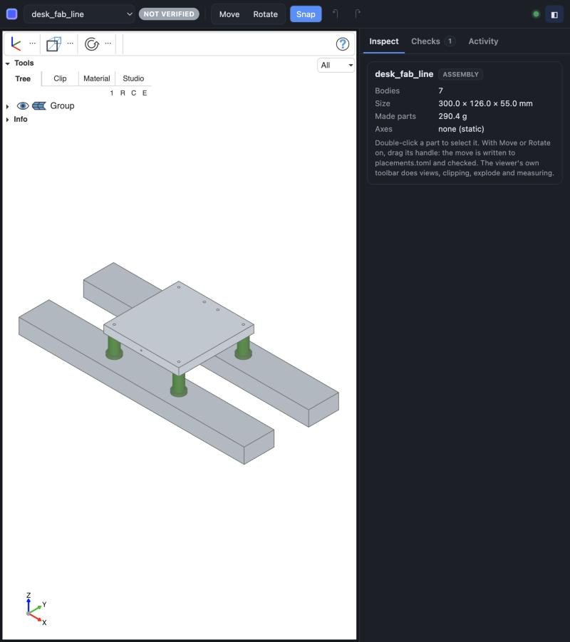
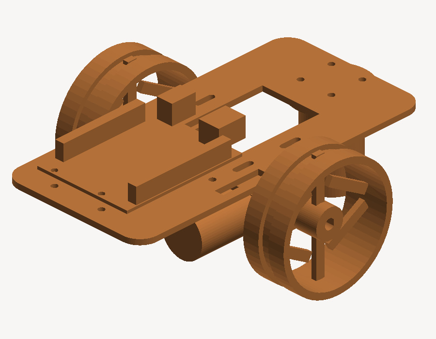
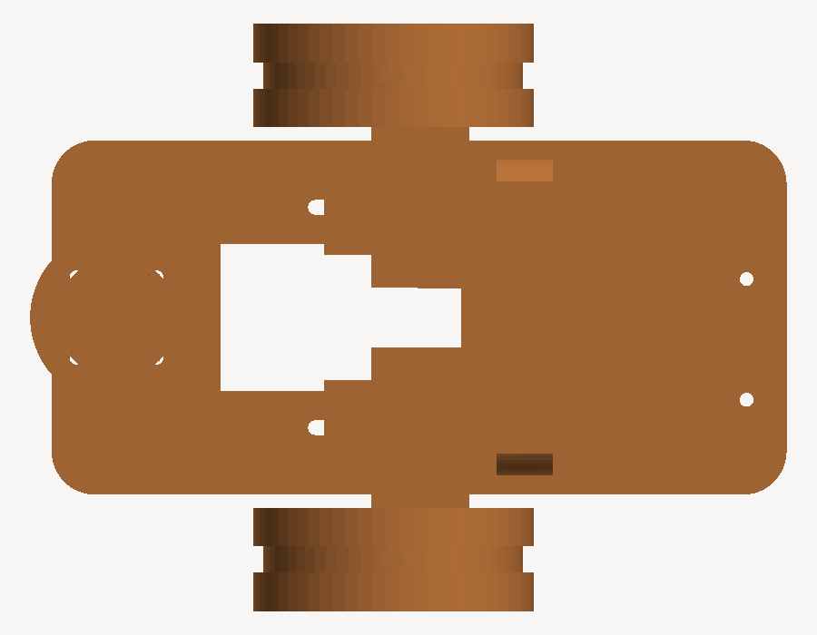

# cad-agent

Agent-driven mechanical CAD. Parametric parts in Python, deterministic gates,
headless renders, and an independent verifier. A harness: agents drive it from
the shell, and a design is done only when `cad verify` says so.

```
bin/cad --help                                   # every command, and the exit codes
bin/cad --projects <dir> check <slug>            # run every gate
bin/cad --projects <dir> verify <slug>           # rebuild fresh, record the verdict with git
bin/cad --projects <dir> done <slug>             # the gate: exit 0 only if that verdict still stands
bin/cad serve [DIR ...]                          # the workbench: live 3D, drag parts, checks, activity
bin/cad pref [KEY [VALUE]]                       # preferences the commands use (MaxUndoSize, CacheLimit, ...)
bin/cad cache [--clear]                          # the user cache: location, size against CacheLimit
.venv/bin/python -m pytest tests -q              # 201 tests
```

## Screenshots

The workbench: live 3D view of a design, with the part inspector and checks.



An Arduino car designed by the agent (headless renders from `cad render`):

| Iso | Top |
|---|---|
|  |  |

## Install as a Claude Code plugin

In Claude Code:

```
/plugin marketplace add El-Guapo2024/cad-agent
/plugin install cad-agent@cad-agent
```

(or from a shell: `claude plugin marketplace add El-Guapo2024/cad-agent` then
`claude plugin install cad-agent@cad-agent`). The plugin brings the `cad` skill, the
`cad-reviewer` agent, the check-on-edit and done-on-stop hooks, and `/cad-agent:workbench`.
On the first session it installs the CLI and the CAD kernel (build123d, OCP; a few
hundred MB, a few minutes) into Claude Code's plugin data folder with `uv` if present,
else Python 3.12+, and puts `cad` on the session's PATH. Designs go to `./cad-projects`
in the project you open (set `CAD_PROJECTS` to change it). Check the manifest with
`claude plugin validate .`. Working inside this repo with the plugin also installed runs
the hooks twice; disable one of them there.

## The workbench

`bin/cad serve` opens a local page at http://127.0.0.1:8733 (or `--port`, or
`$PORT`), and the Claude app's Browser pane opens it too: the `workbench` entry
in `.claude/launch.json` lets the app pick a free port. It
is a client of the CLI: every scene, move, check and approval runs as a `cad`
command, so it shows up in the activity log next to what the agent ran. A click
never starts a process: the server sends each command to the warm worker's
socket itself, and the worker forks it.

**Always on (optional).** `bin/cad service install [DIR ...]` makes the workbench
a macOS login service (launchd). It stays up at http://127.0.0.1:8733 with the
kernel loaded, so opening it launches nothing and never waits on the 8–30 s
kernel import. The cost is about 400 MB held all the time. Point the app at it
with a launch entry that has only `"url"` and `"port"`, so the app attaches
instead of starting a server. `bin/cad service status` says whether it's up,
and `bin/cad service uninstall` removes it.

The 3D view is [three-cad-viewer](https://github.com/bernhard-42/three-cad-viewer)
(MIT, the viewer inside OCP CAD Viewer), fed by
[ocp-tessellate](https://pypi.org/project/ocp-tessellate/). The parts tree,
clipping with filled cuts, explode, measuring, views, zebra and studio
rendering all come from it. The workbench adds only what it lacks:

- **Live.** Edit a part (you or the agent) and the view rebuilds in a few
  seconds, keeping the camera and what you hid.
- **Move parts like Onshape.** Double-click a part to select it, turn on Move
  or Rotate, and drag the handle. It snaps to 1 mm and 15° by default. You can
  also type offsets, or undo with ⌘Z. Each move is written to
  `placements.toml`, and `cad place` answers right away with what the part now
  hits. A full `cad check` then runs in the background.
- **Edit dimensions.** The selected part's `PARAMS` show as fields. Change one
  and press Enter: `cad set` checks that the part still builds with the new
  value, writes that one literal into the part file (comments and layout
  stay, so git shows a one-number diff), and runs the part's gates. ⌘Z undoes
  it. Shape changes (a new hole, a fillet) are the agent's job in the Python.
- **Checks and activity.** Every gate row, the verdict and why `cad done`
  refuses, and a live feed of every `cad` command with its renders. Approving
  a render is a button, and it's your click.

Not carried over from the first version: the per-axis motion sliders.
three-cad-viewer has animation tracks for that, not wired up yet.

**Share a review.** `bin/cad page <slug>` writes a snapshot folder: a title block
with the verdict and commit, the model to turn, cut and measure, every gate row,
parts, and renders. Publish it as a private artifact and send the link. The
reader needs nothing installed, and nothing they do writes back to the design.

`placements.toml` is a design input. Every gate and `cad verify` see it, and git
shows exactly what moved. Fold settled moves into `assembly.py`
(`cad place <slug> <body> --reset` removes an entry).

Open a Claude Code session in this repo and it loads the harness from `.claude/`:
- the `/cad` skill, with the design loop
- a hook that runs `cad check` after every edit to a design file and feeds back what fails
- a stop hook that won't let a changed project go unverified without saying so
- the read-only `cad-reviewer` agent
- permission to run `bin/cad`

Each project states what it must do in `spec.toml` (envelope, clearances and how
far apart a pair may be, the size and position of a body, tool keep-outs, mass
budgets, bolt holes that must line up), and the `spec` gate
checks every entry. A project without one is UNCHECKED. See
`cad_agent/spec.py` for the format and `tests/fixtures/*/spec.toml` for real
examples.

Projects live wherever you keep them: `--projects DIR` or `CAD_PROJECTS`, or
`projects/` here by default. The first call starts a warm worker that imports
the CAD kernel once (20–35 s), then each command takes about a second;
`CAD_WARM=0` runs cold. The v2 plan, the research map behind it, and what is
built are in PLAN_V2.md. The MCP server it replaced was retired on 2026-09-28;
`python -m cad_agent` now runs the same CLI, cold.

### The FreeCAD-style UI (in progress)

`cad serve` also hosts a React version of the workbench at `/next/`
(http://localhost:8733/next/), laid out and styled after FreeCAD's development version (main, the code behind its weekly builds):
- the model tree and the property editor (Data/View tabs) on the left
- a Tasks tab for edits, with OK/Cancel
- the 3D view in the middle, with its navigation cube
- the report view, checks and console underneath, and a status bar

It behaves like FreeCAD too: hovering preselects, a click selects, the keys
0-6 pick standard views, V F fits all, Space toggles visibility and ⌘Z undoes.
Double-clicking a part opens its parameters. The console echoes every `cad`
command, the agent's and the UI's alike, and runs any `cad` command typed into
it, printing what a terminal would. The CAD Agent workbench (the default) puts
check, verify, done, cut list, tables, tool envelopes, bought parts, renders,
approvals and rules in its own menu and toolbar.

### Working together: a person in the UI, an agent in a terminal

Both drive the same project through the same CLI. Model changes (`cad set`,
`cad place`) land in the files, the workbench watches them, and the UI updates;
the person's edits in the UI run the same commands and show up in the activity
log. What only the UI has (the selection, what is hidden, colours, the camera)
is shared through `cad gui`, FreeCADGui's job:

    cad gui state PROJECT                    # what the person has selected, hidden, open
    cad gui select PROJECT post bracket.Face3
    cad gui hide PROJECT beam                # show / hide / clear likewise
    cad gui set PROJECT bracket ShapeColor=#ff0000 Transparency=50   # FreeCAD ViewObject names
    cad gui view PROJECT iso                 # front … iso, home, ortho, persp; `cad gui fit PROJECT`
    cad gui view PROJECT 'OrthographicCamera { position … orientation … height … }'   # an exact camera
    cad gui say PROJECT "look at the hinge"  # a line in the person's Report view
    cad gui commands PROJECT                 # the workbench's commands by FreeCAD name, and which are enabled
    cad gui run PROJECT Std_Placement        # run one, as Gui.runCommand does (opens the task for the person)

`cad gui state` also shows the camera the person is looking through, as
FreeCAD's View > Issue Camera Position prints it, so either side can save a
viewpoint and bring it back with `cad gui view`. `ShowPlacement=true` draws an
object's placement as an axis cross; `cad gui run PROJECT Part_EdgeSelection`
(or Vertex/Face, `Part_RemoveSelectionGate`) limits what the person can pick.

Visibility, colours and selectability persist in `out/gui.json` (FreeCAD keeps
them in GuiDocument.xml); `out/` is outside the verifier's source hash.

Undo is shared too, like a FreeCAD document's: every `cad set`, `cad place` and
bought-part change is journaled with who made it (`ui` or `agent`), Edit > Undo
in the UI and `cad undo PROJECT` in a terminal step back through the same list
(20 steps; `cad pref MaxUndoSize N` or Preferences > Document changes it), and `cad history PROJECT` shows it. Undo refuses when a file was
edited by hand since.

Macros are FreeCAD's, written in `cad` commands: Macro > Record Macro in the UI
records what the person does (model changes as `cad set`/`cad place` lines,
view and selection as `# cad gui …` comments unless Preferences > Macro says
otherwise) into `~/.cad-agent/macros/NAME.cad`. An agent reads one with `cad
macro show NAME` and replays it with `cad macro run NAME`; `cad macro save NAME
FILE` writes one for the person to run from Macro > Macros. `cad
gui` finds the running workbench that serves the project (each `cad serve`
registers itself in `~/.cad-agent/serve/`; `CAD_SERVE_URL` overrides) and exits
2 when none is running.

The source is in `ui/` (Vite, React, TypeScript, dockview, three-cad-viewer).
The build lands in `cad_agent/workbench/next/`, so running it needs no Node:

    cd ui && npm install && npm run build   # after changing ui/src
    npm run dev                              # live-reloading dev server on :5173, API proxied to :8733

Its colours and layout are ported from FreeCAD (LGPL-2.1-or-later; those files
say so), and its icons are FreeCAD's for now (`ui/public/freecad-icons/README.md`).

## Why build123d and not a GUI CAD

The loop is: change a parameter, rebuild, measure interference, render, look,
repeat, in seconds, with no application running and every change visible in a
git diff. That needs a code-first B-rep kernel.

- **OpenSCAD** has no edges and no B-rep, so there is no fillet on a selected
  face, no STEP import of a vendor part, and no way to ask how close two
  solids are. Fit checking becomes squinting at a picture.
- **FreeCAD** is scriptable and headless, but the document is a binary
  `.FCStd` with no diff, and topological naming breaks a model when an
  earlier feature changes — the worst possible property for a loop that edits
  parameters every iteration. Its kernel is OCCT, which is what build123d
  gives us without the document layer.
- **Fusion 360 / SolidWorks** script only inside a running, licensed GUI. No
  headless, no CI.
- **Onshape** has a real API but every rebuild is a network round trip and the
  design lives on someone else's server.

Exporting STEP and opening it in FreeCAD to look or dimension is fine. The
Python stays the source of truth.

## Layout

```
cad_agent/
  geom.py       OCCT queries: min distance, overlap volume, mass, bbox
  parts.py      ISO 273 hole tables, tap drills, insert bores, extrusions
  render.py     tessellate, backend dispatch, numpy z-buffer fallback, PNG writer
  metal_render.py  GPU rasteriser via PyObjC Metal. Offscreen, no window
  checks/fit.py every pair: interference volume or measured gap vs required
  checks/dfm.py per process: envelope, measured wall, in-plane web, feature count
  checks/web.py section a flat part, measure the material between its boundaries
  thickness.py  ray-cast wall thickness, so a part cannot declare its own
  runner.py     check_all writes checks.json; done_check is the gate
  bought.py     vendor STEP or measured-with-a-source geometry, provenance enforced
  registry.py   the check registry: Row, scopes, and the @register decorator
  rules.py      every check, registered. The list of what a run verifies
  checks/visual.py  render drift against approved baselines, with diff images
  cutlist.py    stock derived from each part's CUTLIST, roughly priced
  export.py     STEP for a shop, STL for a printer
  cli.py        the cad CLI: every command, --json, exit codes, activity log
  warm.py       the warm worker: kernel imported once, a fresh fork per command
  verify.py     the verifier: fresh rebuild, source and engine hashes, git, cad done
  spec.py       spec.toml, the brief as acceptance tests
  placements.py placements.toml: parts moved by hand, applied under every gate
  scene.py      out/scene.json: ocp-tessellate data for the viewer, plus moves, axes, masses
  serve.py      cad serve: the workbench server, live events, CLI-backed actions
  service.py    cad service: the workbench as a macOS login service, kernel kept warm
  page.py       cad page: a review snapshot to publish as an artifact
  workbench/    the pages on three-cad-viewer: workbench (index.html, app.js),
                review page (page.html, page.js), its stylesheet (vendor/)
.claude/        the /cad skill, the check and stop hooks, the cad-reviewer agent, launch.json
projects/<slug>/
  mech_profile.md  parts/*.py  assembly.py  bought/*.step  out/  checks.json
```

## Render backend

Two backends, chosen automatically. `cad --version` and `cad tables` both
name the one in use.

**Metal, the default.** macOS has no EGL, so the usual headless OpenGL path
does not exist and pyrender cannot start. Metal is Apple's supported route and
PyObjC reaches it, so `metal_render.py` talks to it directly: an offscreen
colour texture plus a depth texture, one render pass, no window and no
window-server session. It works over ssh and in a subprocess. Shading is
computed in numpy and the triangles are sent unindexed, so each carries its
own flat colour and the shader needs no per-primitive data.

**numpy z-buffer, the fallback.** Pure numpy, hand-rolled PNG writer, no
image library and no GPU. Kept so a machine without Metal renders rather than
fails. `CAD_RENDER_BACKEND=numpy` forces it.

A test asserts the two agree pixel for pixel within edge-coverage noise, so a
render is evidence either way.

| Subject | Triangles | numpy | Metal | |
|---|---|---|---|---|
| hot plate | 2,620 | 0.98 s | 0.021 s | 47x |
| assembly, 7 parts | 5,668 | 0.73 s | 0.027 s | 27x |
| fine torus | 127,008 | 10.4 s | 0.396 s | 26x |
| very fine sphere | 201,558 | 16.1 s | 0.610 s | 26x |

The numpy path loops over triangles in Python, so it grows with triangle
count in a way the GPU does not. Metal keeps a dense model interactive.

## Bought parts carry provenance

Geometry for a bought part comes from the vendor, never from memory. A
remembered bolt circle is how an assembly passes every check and still does
not fit. Two routes, both recording where the numbers came from:

- **STEP** — the vendor's file in `projects/<slug>/bought/`, with a sidecar
  naming the page it came from. Registering one without a source is refused.
- **MEASURED** — a module declaring dimensions with a `SOURCE` naming the
  drawing, datasheet page or calliper reading. No `SOURCE`, no load.

Either may set `VERIFIED = False` for numbers taken from a listing that never
published them. That is reported everywhere the part appears and fails
`done_check`, so an unconfirmed dimension cannot quietly become load-bearing.

A STEP carries its donor assembly's coordinates, so an assembly must
re-origin bought geometry rather than assume it is centred. The SK-Cube
bracket in the first project lands at (-270.8, -541.0, 171.5).

## Adding a check is one function

Checks live in `rules.py` and register themselves. The runner discovers them,
the gate consumes them, and the report prints them, with no other edit:

```python
@register(scope="part", name="web")
def web_rule(ctx):
    yield Row(subject=ctx.name, rule="web", state="PASS",
              measured="4.1 mm at (-82.9, -9.2)", limit="1.5 mm",
              source="closest approach over 120 boundary pairs")
```

Scope decides what the runner hands you: `part` once per part with the built
solid, `assembly` once with every positioned solid and the clearance table,
`project` once with the whole directory. `cad rules` prints what is
registered.

Four states, and only four. `UNCHECKED` is not a pass — it means a rule could
not be settled, and it fails the gate exactly as a failure does. `N/A` is
different: the rule does not apply to this subject. Every row names its limit
and where that limit came from, so a reader can disagree with the threshold
rather than with the number. A check that raises becomes one `UNCHECKED` row
instead of killing the run, because one broken rule must not hide the rest.

Shipped checks:

| Check | Scope | Verifies |
|---|---|---|
| `geometry` | part | envelope, measured wall, in-plane web, feature count |
| `visual` | part | silhouette coverage, drift from the approved render, drawn extent |
| `fit` | assembly | interference and clearance, every pair |
| `stance` | assembly | footprint area at the contact plane |
| `sweep`, `reach` | assembly | each declared axis swept through its travel; the tool point covers the work span |
| `placements` | assembly | which bodies were moved by hand; an entry for a missing body is UNCHECKED |
| `spec` | assembly | every requirement in spec.toml |
| `provenance` | project | whether each bought part records, and confirms, its source |

## Visual regression

A render is a checkable artifact. Approve an image once, and every later run
reports what fraction of the frame changed and writes a diff with the changed
pixels marked in red. Change a parameter and the run tells you which views
moved and by how much, instead of you flicking between pictures.

Until a view is approved its drift rule is `UNCHECKED`, so a project with no
baselines does not silently pass. Approve with `approve_render`, but look at
the diff first: approving blindly is how the rule gets turned off.

Three rules come out of the same pair of images. **Silhouette** is the
fraction of the frame the part covers, and near zero is how a broken build
looks when the solid is empty but the render still succeeds. **Drift** is the
fraction of pixels that differ. **Extent** is whether the drawn bounding box
moved, which separates a change of shape from a change of position or scale.

Tolerances are stated in every row: a pixel counts as changed past a channel
difference of 24, and drift is a failure past 0.2% of the frame. Both exist
because rasterisation is not exact at silhouette edges.

## Nothing is taken on the part's word

Two rules used to be declared by the part and believed by the gate. Both are
measured now, after two faults reached a published page because nothing could
see them.

**Wall thickness** is ray cast through the solid: sample the surface, step
inside, shoot along the inward normal, and take the distance to the first
exit. It gates on the 1st percentile, because a grazing ray at a sharp edge
returns a near-zero distance that describes the tessellation rather than the
part. A part that understates its own thickness is corrected, not believed.

**Web width** works in the plane, because ray casting cannot see the fault it
catches: on a 3 mm sheet every inward ray measures 3 mm, whether it starts in
the middle of the plate or in the 0.8 mm strip between two slots. So flat
parts are sectioned instead, and the distance measured between the outer
boundary and every cutout. One section yields three rules:

| Rule | Catches |
|---|---|
| web width | a hole too near an edge, or two cutouts nearly meeting |
| feature count | one cutout swallowing another, or breaking out through an edge |
| region count | a part severed into pieces by its own features |

The web rule reports the coordinate of the narrow point. A failure naming an
anonymous feature index cannot be acted on.

## The gates fail, they do not report

`done_check` returns `ok:false` on any FAIL **and** on any UNCHECKED. A wall
thickness that was never measured is not a pass. This is deliberate: an
unreviewed finding that joins a pile is a finding nobody acts on.

`N/A` is distinct from a pass: it marks a rule that does not apply, such as
the in-plane web rule on a chunky part.

## First project

`projects/desk_fab_line` — the two-cell Desk Fab Line. Built so far: the
reflow hot plate and its ceramic standoffs, docked over 2040 floor rails,
with the plate-to-frame air gap gated at 20 mm. The plate takes either a flat
mica element underneath or two cartridge bores, chosen by a parameter, because
which heater to buy is still open.

`done_check` is deliberately red on this project: the mica heater's dimensions
came from no published drawing, and the gate holds the project open until they
are confirmed. Geometry and manufacturability are green.
